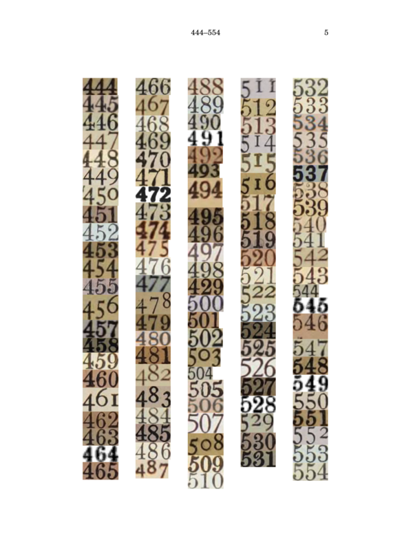
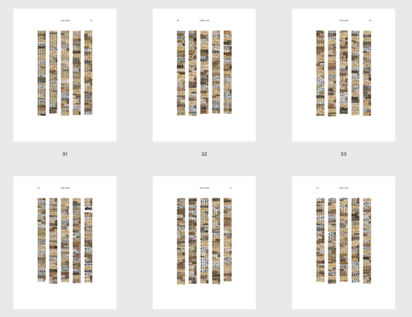
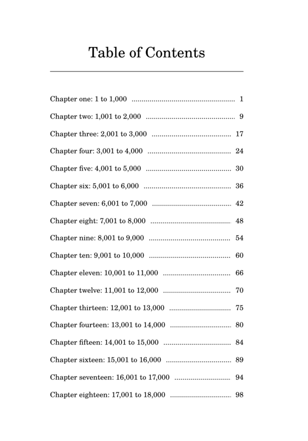
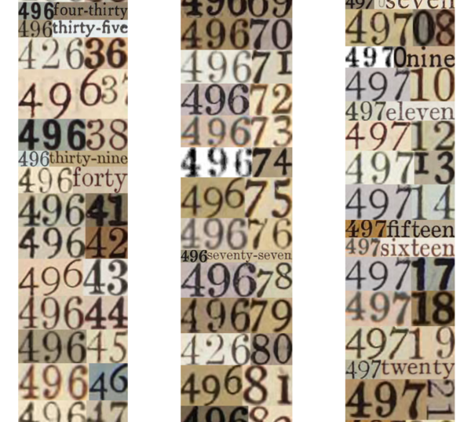
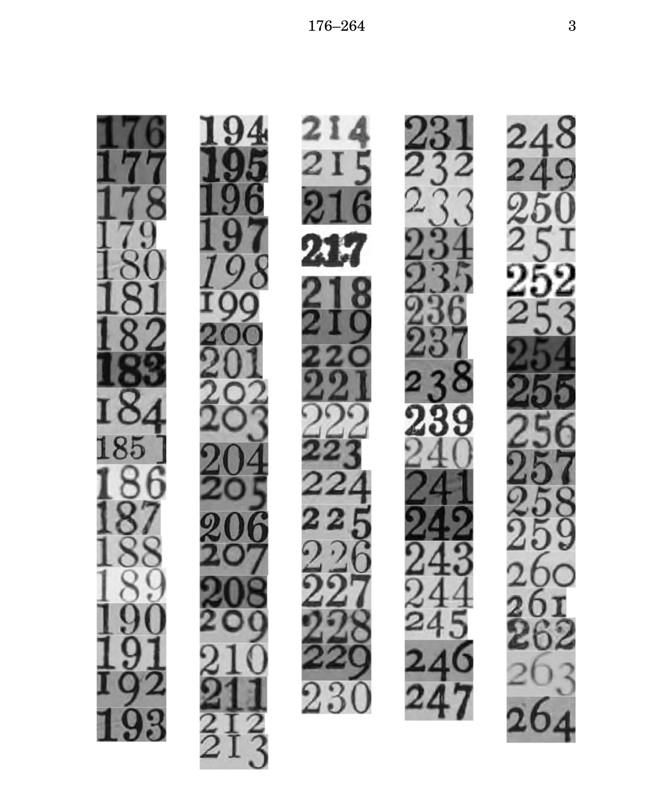

# The numbers, one to 50 thousand 

Generate a PDF of a book containing the numbers one to fifty-thousand as automatically extracted from a corpus of scanned books.




## Steps

1. **Fetch copyright-free books from the Internet Archive**
   ```bash
   python fetch_from_ia.py <email> <collection> --limit <count>
   ```
   Downloads books with hOCR and page images from specified collection. You must supply an email address that will be bundled as part of the HTTP request to IA.

   Anywhere from 200 to 1,000 individual books should provide a good range of source material for 
   visually-interesting output.

2. **Extract number images**
   ```bash
   python extract_all_numbers.py
   ```
   For each page of each book, extract individual PNG files of digits and number words in the range from 0-50,000.

3. **Compose missing numbers**
   ```bash
   python compose_missing_numbers.py
   ```
   For numbers missing from the range of one to 50 thousand, "compose" number images out of existing primitives extracted in step 2.

4. **Build the book!**
   ```bash
   python build_book.py --max-number 50000
   ```

   Generate a PDF file (and intermediate HTML output) of the number pages, along with a table of contents and cover page.

## Suggested Internet Archive collections

Best collections with hOCR data by item count (pre-1925, English, public domain):

- americana: 987,258
- toronto: 251,969
- cdl: 182,334
- internetarchivebooks: 158,978
- university_of_toronto: 156,370
- library_of_congress: 149,071
- bostonpubliclibrary: 36,520
- allen_county: 28,794
- gerstein: 22,114
- cornell: 21,352
- trent_university: 10,177


## More examples

Spreads:



Generated table of contents:



Detail:



Also in black-and-white if you like:


